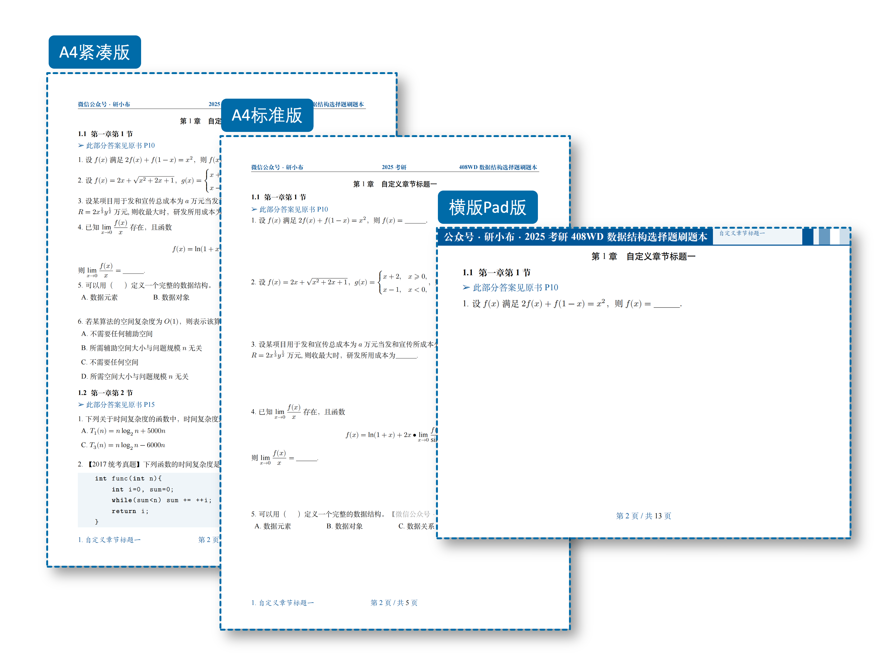
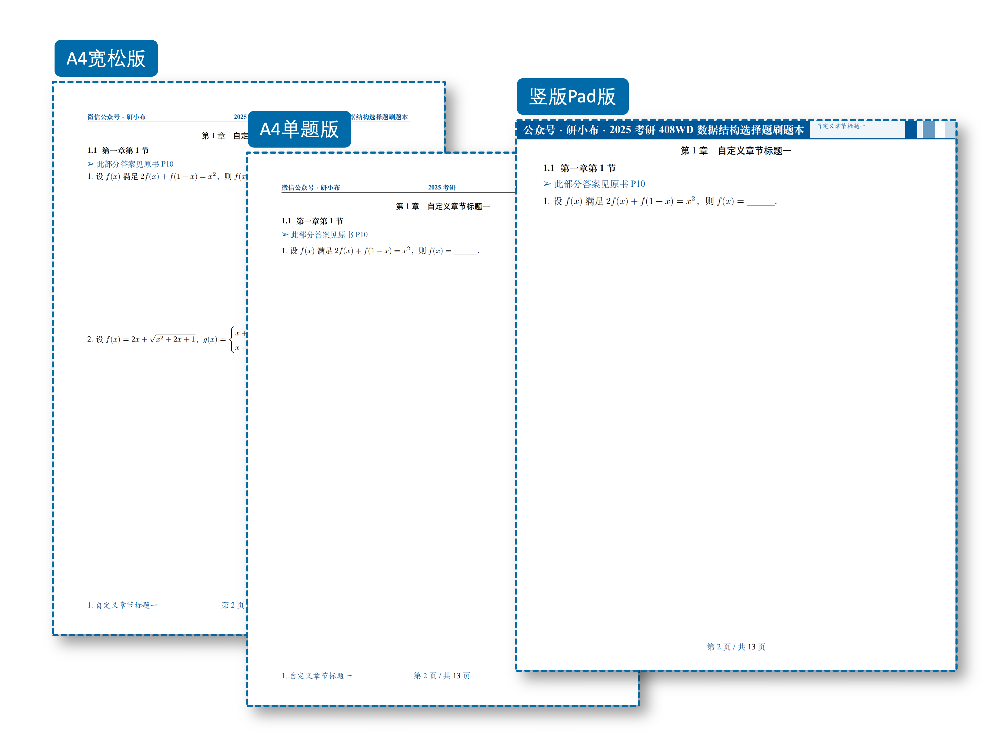
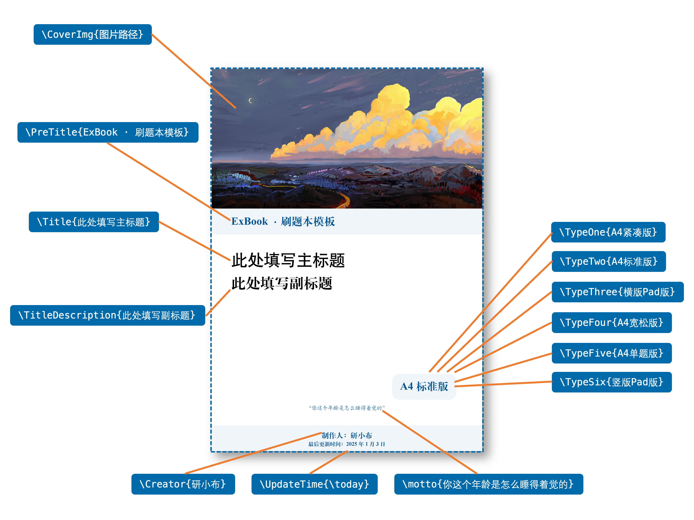

<div align="center">
    <a href="https://exbook.github.io/">官方网站</a>
</div>

# 简介
**ExBook** 是一个专门制作做题本/刷题本的 LaTex 文档类，只录入一次题目，就可以快速生成6种版式的PDF文档（如下图）。

<!-- 

 -->
<div align="center">
    
    
</div>

**功能特点：**
1. 录入一次题目，就可以生成6种版式（A4紧凑版、A4标准版、A4宽松版、A4单题版、横版Pad版、竖版Pad版）的PDF文档，无需手动修改任何格式；
2. 支持制作**文字录入型刷题本**以及**截图型刷题本**；
3. 支持选择题选项自动排版，可根据选项的文字长度自动排列选项；
4. 极简自定义封面、页眉、页脚等，极简插入图片，无需关注复杂的 LaTex 代码；
5. 提供12种美观易用的颜色主题，包含4种经典主题以及8种个性主题；
6. 支持自定义添加水印，包含**行内文字水印**以及**全局页面水印**；
7. 支持代码高亮。

# 如何使用
1. 配置本地 Latex 环境（或直接使用Overleaf）
2. 拷贝此项目到本地（或 overleaf）

注意：使用此项目需要一点 Latex 基础！

# 项目结构说明
* `ExBoook.cls`：ExBook 文档类，不用管，也不要随便修改；
* `config.tex`：配置文件，在此文件中详细设置页眉、页脚、封面、主题颜色等；
* `main.tex`：文档内容源文件；
* `contents`文件夹：
    * `content_type_one.tex`：制作文字录入型刷题本所要录入的内容（对应 `main.tex` 重的 `\include{contents/content_type_one}`）；
    * `content_type_two.tex`：制作截图型刷题本所要录入的内容（对应 `main.tex` 重的 `\include{contents/content_type_two}`；
    * `pre.tex`：“声明”部分；
* `img` 文件夹：存放项目图片（封面、水印等）
* `fig` 文件夹：存放文字录入型刷题本的题目插图
* `splitImg` 文件夹：存放截图型刷题本的所有题目图片

注：`main.tex` 中，制作文字录入型刷题本时，只需要保留`\include{contents/content_type_one}`；制作截图型刷题本时，只需要保留`\include{contents/content_type_two}`。

# 文档类参考

## 文档类选项
**字体选项（建议使用 `fandol`）：**
* `adobe`：使用 adobe 字体
* `ubuntu`：使用 ubuntu 字体
* `windows`：使用 windows 字体
* `fandol`：使用 fandol 字体，随 texlive 默认安装
* `mac`：使用 mac 字体

**版式选项：**
* `standard`：A4 标准版。每个题目有一定空隙（大概3cm左右），每道题目的内容会强制在同一页，对于选择题而言，题目和选项不会跨业出现；
* `loose`：A4宽松版。每页会有 2 题，对于较长的题目，会自动占用一页；
* `compact`：A4紧凑版。题目间无任何空隙；
* `single`：A4单题版。一页只会出现一题；
* `padl`：横版Pad版。平板刷题，一页一题，适合小题（选择题和填空题）；
* `padp`：竖版Pad版。平板刷题，一页一题，适合大题。

**其他选项：**
* `printmode`：只在A4版下有效，可生成适合双面打印的文档
* `water`：是否显示全局页面水印（水印图片可在配置文件中自定义，水印将显示在页面右下角）
* `online`：在封面显示在线文档链接

## 封面设置
打开 `config.tex`，以下配置项可自定义封面内容：
```latex
% 封面设置
\CoverImg{img/cov01.jpg} % 封面图片
\PreTitle{ExBook · 刷题本模板} % 前置标题
\Title{此处填写主标题} % 主标题
\TitleDescription{此处填写副标题} % 副标题
\TypeOne{A4紧凑版} % A4紧凑版下的类型标识
\TypeTwo{A4标准版} % A4标准版下的类型标识
\TypeThree{横版Pad版} % 横版Pad版下的类型标识
\TypeFour{A4宽松版} % A4宽松版下的类型标识
\TypeFive{A4单题版} % A4单题版下的类型标识
\TypeSix{竖版Pad版} % 竖版Pad版下的类型标识
\motto{你这个年龄是怎么睡得着觉的} % 封面座右铭
\Creator{研小布} % 制作人
\UpdateTime{\today} % 更新时间
\OnlineCheckUrl{https://github.com/ExBook/ExBook} % 在线勘误文档地址
```
说明如下：


## 页眉页脚设置
打开 `config.tex`，以下配置项可自定义页眉页脚：
```latex
% 页眉页脚设置
\Lhead{微信公众号·研小布} % 左页眉 
\Chead{2025考研} % 中页眉、平板模式（padl或padp）下页眉中间的文字
\Rhead{408WD数据结构选择题刷题本} % 右页眉、平板模式（padl或padp）下页眉右侧的文字
\LheadC{公众号·研小布·} % 平板模式（padl或padp）下页眉左侧的文字
```

## 主题颜色设置
打开 `config.tex`，以下配置项可自定义颜色主题（默认为`\blue`）：
```latex
% 页眉页脚设置
\setThemeColor{\blue}
```

ExBook 提供4种经典颜色和8种个性颜色。

1. 4种经典颜色主题

    

    如果你是一个专门制作做题本/刷题本的博主，那么建议选择这四种经典颜色。

2. 8种个性颜色主题

    

    这八种个性颜色分别来自八种常见的MBTI人格的代表色，可以选择你自己喜欢的颜色。
## 题目录入环境及命令

1. 题组环境
   ```latex
   \begin{qitems}[r]

   \end{qitems}
   ```
   环境选项：`r`（从 1 开始计数）
2. 题目环境
   ```latex
   \begin{bbox}

   \end{bbox}
   ```
3. 题目命令
    ```latex
   \qitem 题目内容
   ```
4. 小问环境
   ```latex
    \begin{subqitems}
            \subqitem 第一小问
            \subqitem 第二小问
    \end{subqitems}
   ```
5. 选择题选项命令
   ```latex
    \threechoices{选项内容}{选项内容}{选项内容}         % 四个选项
    \fourchoices{选项内容}{选项内容}{选项内容}{选项内容}        % 五个选项
    \fivechoices{选项内容}{选项内容}{选项内容}{选项内容}{选项内容}      % 六个选项
    \sixchoices{选项内容}{选项内容}{选项内容}{选项内容}{选项内容}{选项内容}{选项内容}   % 七个选项
   ```
6. 代码高亮环境
   ```latex
   \begin{lstlisting}[escapeinside={(*@}{@*)}]
    此处输入代码
   \end{lstlisting}
   ```
7. 其他命令
   * 空括号（英文和中文）
    ```latex
    \blankbox % 中文空括号
    \eblankbox % 英文空括号
    ```
   * 空下划线
    ```latex
    \blankline % 空下划线
    ```
   * 文字水印命令
    ```latex
    \textwater % 文字水印的内容在 config.tex 中自定义
    ```
   * 插入题目图片命令
    ```latex
    \imgin{0.2}{fig/img01.png} % 第一个参数为缩放比例，第二个参数为图片路径
    ```
   * 答案页指示命令
    ```latex
    \qanswerloc{10} % 将会显示 “此部分答案见原书 P10”
    ```

## 页面水印设置
打开 `config.tex`，以下配置项可自定义全局页面水印：
```latex
\WaterImg{img/water.png} % 图片水印 出现在页面的右下角
```

## 完整例子：
* `main.tex`
```latex
% 使用 ExBook 文档类，并传递选项
\documentclass[cs4size,fandol,standard,online]{ExBook} 

\begin{document}
 
\include{config} % 示例文件
\maketitle 

% 免责声明文件
\include{contents/pre} % 示例文件

\setcounter{page}{1}
\tableofcontents
 
\clearpage 

\include{contents/content_type_one} % 示例文件
% \include{contents/content_type_two} % 示例文件

\end{document}
```

* `content_type_one.tex`
```latex
\section{自定义章节标题一}
\subsection{第一章第1节}\qanswerloc{10}

\begin{qitems}[r]

    \begin{bbox}
        \qitem   设$f(x)$满足$2f(x)+f(1-x)=x^2$，则$f(x)=\blankline.$
    \end{bbox}

    \begin{bbox}
        \qitem   设$f(x)=2x+\sqrt{x^{2}+2x+1}$，$g(x)=
        \begin{cases}
        x+2, & x\geqslant0, \\
        x-1, & x<0,  
        \end{cases}$，则$g[f(x)]= \blankline$.
    \end{bbox}

    \begin{bbox}
        \qitem   设某项目用于 发和宣传 总成本为$a$万元 当 发和宣传所 成本分别为$x$万元和 $y$ 万元时， 收益为$R=2x^{\frac{1}{3}}y^{\frac{1}{2}}$万元,则收 最大时，研发所用成本为\blankline.
    \end{bbox}

    \begin{bbox}
        \qitem   已知 $\lim\limits_{x\to0}\dfrac{f(x)}{x}$ 存在，且函数
        $$f(x)=\ln(1+x)+2x\bullet\lim_{x\to0}\frac{f(x)}{\sin x}$$
        则$\lim\limits_{x\to0}\dfrac{f(x)}{x}=$ \blankline.
    \end{bbox}

    \begin{bbox}
        \qitem  可以用\blankbox 定义一个完整的数据结构。\textwater

        \fourchoices{数据元素}{数据对象}{数据关系}{抽象数据类型}     
    \end{bbox}

    \begin{bbox}
        \qitem   若某算法的空间复杂度为$O(1)$，则表示该算法\blankbox 。
        \fourchoices
        {不需要任何辅助空间}
        {所需辅助空间大小与问题规模$n$无关}
        {不需要任何空间}
        {所需空间大小与问题规模$n$无关}
    \end{bbox}
\end{qitems}

\subsection{第一章第2节}
\qanswerloc{15}

\begin{qitems}[tr]

    \begin{bbox}
        \qitem   下列关于时间复杂度的函数中，时间复杂度最小的是\blankbox 。
        \fourchoices
        {$T_1(n)=n\log_2n +5000n$}
        {$T_2(n)=n^2 - 800n$}
        {$T_3(n)=n\log_2n - 6000n$}
        {$T_4(n)=20000\log_2n$}
    \end{bbox}

    \begin{bbox}
        \qitem   【2017 统考真题】 下列函数的时间复杂度是 \blankbox 。
        \begin{lstlisting}
    int func(int n){
        int i=0, sum=0;
        while(sum<n) sum += ++i;
        return i;
    }
        \end{lstlisting}
        \fourchoices{$O(\log n)$}{$O(n^{\frac{1}{2}})$}{$O(n)$}{$O(n\log n)$}
    \end{bbox}

\end{qitems}

\section{自定义章节标题二}
\subsection{第二章第1节}
\qanswerloc{20}
\begin{qitems}[tr]
    
    \begin{bbox}
        \qitem  已知曲线$L:y=\ln\sqrt{x}(2\leqslant x\leqslant4)$，在$L$ 上的任意点$P(x,y)$作切线，记切线与曲线$L$在 $2\leqslant x\leqslant4$
        时所围成的有界区域的面积为$S$.
        \begin{subqitems}
            \subqitem 求一点$P_0$，使上述面积$S$关于$x$的变化率为零；
            \subqitem 当点$P(x,y)$在曲线上移动至$(\mathrm{e},\dfrac{1}{2})$时，横坐标关于时间的变化率为1，求此时面积关于时间的变化率$\dfrac{\mathrm{d}S}{\mathrm{d}t}.$
        \end{subqitems}

    \end{bbox}

    \begin{bbox}
        \qitem 以 $yOz$ 面上的平面曲线段$y=f(z)(z\geqslant0)$ 绕$z$轴旋转一周所成旋转曲面与xOy 面围成一个无上盖容器(见图)，现以 3 cm$^3/$s 的速率把水注人容器内，水面的面积以$\pi$ c$m^2$/ s 的速率增大.已知容器底面积为 16$\pi$ c$m^2$,求曲线$y=f(z)$的方程.
        \imgin{0.2}{fig/img01.png}

        % \includegraphics[width=0.2\textwidth]{img/img01.png}
    \end{bbox}

    \begin{bbox}
        \qitem   分析以下各程序段， 求出算法的时间复杂度.
        \begin{lstlisting}[escapeinside={(*@}{@*)}]
    (*@\ding{172}:@*)
    i=1; k=0;
    while(i<n-1){
        k=k+10*i;
        i++;
    }

    (*@\ding{173}:@*)
    y=0;
    while((y+1)*(y+1)<=n)
    y=y+1;

    (*@\ding{174}:@*)
    for(i=0;i<n;i++)
        for(j=0;j<m;j++)
            a[i][j]=0;
    
        
        \end{lstlisting}
    \end{bbox}

    \begin{bbox}
        \qitem   【2011 统考真题】一个长度为 $L$（$L\geqslant 1$ ）的升序序列$ S$, 处在第$\lceil L/2\rceil $个位置的数称为 $S$
        的中位数。例如，若序列 $S_1$=（11,13,15,17,19）, 则 $S_1$的中位数是 15, 两 个序列的中位
        数是含它们所有元素的升序序列的中位数。例如，若 $S_2$ =（2,4,6,8,20）, 则$S_1$和$S_2$的中
        位数是 11。现在有两 个等长升序序列$A$和$B$, 试设计一个在时间和空间两 方面都尽可能
        高效的算法，找出两个序列 $A$和$B$的中位数。要求：
        \begin{subqitems}
            \subqitem 给出算法的基本设计思想
            \subqitem  根据设计思想，采用 C 或 C++或 Java 语言描述算法，关键之处给出注释
            \subqitem 说明你所设计算法的时间复杂度和空间复杂度
        \end{subqitems}
    \end{bbox}
\end{qitems}
```

显示效果见文档 [./build/main.pdf](./build/main.pdf)
